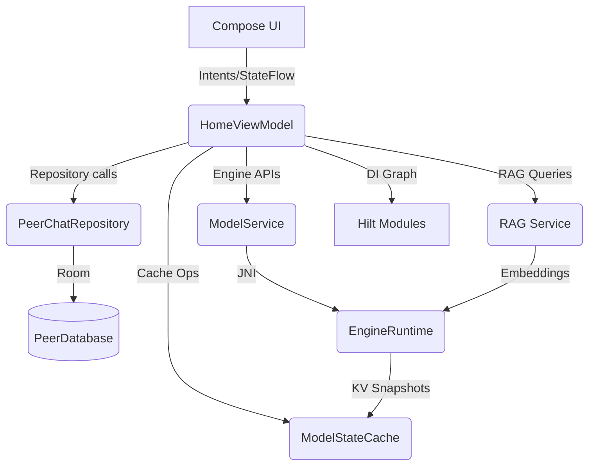

# PeerChat Architecture

## Overview

PeerChat is a multi-module Android application providing on-device AI chat with RAG capabilities. The architecture emphasizes offline-first operation, security, and performance.



The UI layer (Compose) interacts with `HomeViewModel` which orchestrates repository operations, engine lifecycle, and retrieval augmentation. Hilt injects dependencies into ViewModels/Services so the same graph is used across debug and release builds.

## Module Structure

```
app/          - Main application, UI (Compose), navigation, ViewModels
engine/       - llama.cpp JNI wrapper, inference runtime, state management
data/         - Room database, entities, DAOs, migrations
rag/          - RAG service, chunking, hybrid search
templates/    - Chat template definitions and autodetect
docs/         - Document processing (PDF, OCR)
```


## Dependency Injection

The application now uses Hilt to provide singletons for repositories, services, and engine adapters:

- `ServiceModule` supplies `ModelManifestService`, `ModelRepository`, `ModelService`, `DocumentService`, `SearchService`, `ModelStateCache`, and the shared `Retriever` instance.
- `DataModule` exposes the Room `PeerDatabase` and `PeerChatRepository` singletons.
- `ViewModelModule` contributes utility singletons (`PromptComposer`, `StreamingEngine`, `OcrService`).
- `PeerChatApp` is annotated with `@HiltAndroidApp`, while activities/composables resolve ViewModels via `hiltViewModel()`.

This eliminates the old `ServiceRegistry` singleton and ensures feature modules receive consistent dependencies in both production and tests.

## Data Flow

### Model Loading Flow

```
HomeViewModel.loadModelInternal()
  → EngineRuntime.unload() // Clear previous
  → EngineRuntime.load(config)
    → EngineNative.loadModel() // JNI
      → llama_model_load_from_file()
  → EngineNative.detectModel() // Extract GGUF metadata
  → ModelManifestService.ensureManifestFor()
    → Compute SHA-256, extract family/template
  → Update UI state with detected template
```

### Chat Inference & Metrics Flow

```
HomeViewModel.sendPrompt()
  → ModelStateCache.restore() // Restore KV cache for chat
  → Repository.insertMessage() // Save user message
  → RagService.retrieveHybrid() // Semantic + FTS5 retrieval
  → RagService.buildContext() // Compose RAG context
  → PromptComposer.compose()
    → TemplateCatalog.resolve() // Select/detect template
    → Template.build() // Format prompt with history
  → StreamingEngine.stream()
    → EngineNative.generateStream() // JNI streaming
      → llama_decode() loops with sampling
    → Collect tokens, detect reasoning regions & duration
  → Repository.insertMessage() // Save assistant message
    → Persist TTFS/TPS/context%, reasoning text, and reasoning duration/length
  → ModelStateCache.capture() // Persist KV cache
```

### Document Indexing Flow

```
HomeViewModel.importDocument()
  → Extract text (PDF/OCR/text)
  → Repository.upsertDocument()
  → RagService.indexDocument()
    → TokenizerAwareChunks() // Binary search with model tokenizer
    → EngineNative.embed() // Generate embeddings
    → Repository.upsertEmbedding()
    → Repository.insertChunk() // Store chunk with positions
```

## Key Components

### EngineRuntime

Central engine state manager:
- Thread-safe model loading/unloading
- Metrics tracking via StateFlow
- KV cache capture/restore per chat
- GGUF metadata detection and caching

### ModelManifestService

Model lifecycle management:
- Manifest registration with SHA-256 checksums
- Template detection from GGUF kv metadata
- Verification and integrity checks
- Family and context length extraction

### RagService

RAG retrieval engine:
- Hybrid search: semantic (70%) + lexical FTS5 (30%)
- Rank fusion with configurable weights
- Tokenizer-aware chunking using model tokenizer
- Embedding generation via llama.cpp

### PromptComposer & Reasoning Parser

Template-aware prompt building:
- Template autodetect or manual override
- History normalization (merge consecutive same-role)
- System prompt insertion
- Stop sequence configuration
- `ReasoningParser` splits visible vs reasoning tokens, tracking `<think>` blocks and timing for reasoning duration analytics.

## Security

- **EncryptedSharedPreferences**: Model paths and sensitive configs encrypted at rest
- **Filename sanitization**: Path traversal prevention in ModelStorage
- **Atomic writes**: Temp file → atomic move for model imports/downloads
- **SHA-256 verification**: Model integrity checks on import and verify
- **Scoped storage**: All files in app-private directories

## Performance

- **KV cache persistence**: Per-chat snapshots for fast context restore
- **LRU cache telemetry**: Hits/misses/evictions and byte usage exposed via `ModelRepository.CacheStats`
- **Streaming inference**: Real-time token delivery with backpressure
- **Hybrid search**: Combines semantic accuracy with lexical speed
- **Tokenizer-aware chunking**: Accurate token counts prevent overflow
- **Vulkan acceleration**: GPU offload for inference (configurable layers)

## State Management

- **ViewModel**: HomeViewModel manages UI state and business logic
- **Repository**: PeerChatRepository provides data access abstraction
- **Room**: Persistent storage with FTS5 for search
- **StateFlow**: Reactive state for engine status/metrics
- **Cache stats**: `ModelStateCache` exposes cache telemetry for UI diagnostics

## Error Handling

- Graceful degradation: OCR failures return empty text
- Model load failures: Clear state, show toast
- Stream errors: Mark metrics.error, persist failure state
- Atomic operations: Temp files cleaned on failure
